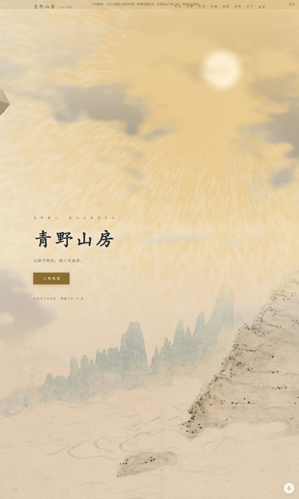
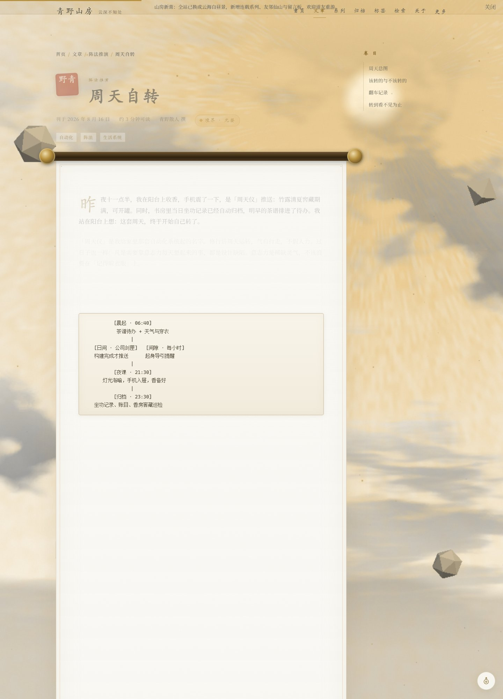

# 青野山房 · qingye_blog

> 云深不知处，码上见真章。

「青野山房」是一个以修仙意境写技术博客的个人站点，以云海仙山、白玉窗棂与青金纹饰，记录青野散人的代码、修行与云游日常。

基于 **Astro + Three.js + Node.js + SQLite** 构建。首页是一方可环顾、缩放和御风寻山的三维洞天，六处浮岛连接文章、连载、符印、归档、关于与留言。阅读时在世界上方展开书卷，收卷后回到所在地点；独立页面仍可直接访问。文章直接以 Markdown 写作和静态发布；Node 服务提供读者账号、评论与收藏同步。

[博客能力说明](docs/blog-features.md) · [运行与部署](docs/deployment.md) · [Docker 部署](docs/docker.md) · 前台 `/`

## 旧版截图（历史存档）

| 首页 · 云海水墨 Hero | 文章页 · 宣纸卷轴正文 |
| :---: | :---: |
|  |  |

## 功能一览

- **内容体系**：Markdown 文章（Content Collections 校验 frontmatter），支持标签、分类、连载系列三种组织方式
- **归档 / 标签 / 分类 / 系列** 独立索引页，自动生成
- **全文检索**：完整正文与代码索引、组合筛选、排序、分页、命中高亮与可分享检索地址
- **留音与账号**：数据库评论与回复、审核后公开；读者直接注册、账号设置与密码恢复工具
- **袖囊**：收藏、阅读历史与断点续读，本机记录及账号同步；不同账号本机数据隔离，支持主动导入访客袖囊
- **订阅与搜索引擎**：全站与主题 RSS、JSON Feed、Sitemap、robots、canonical、Open Graph 和 JSON-LD
- **内容与备份**：直接编辑 Markdown、使用 Git 管理文章版本；SQLite 一致性备份、Markdown 与既有媒体副本
- **云海与光影**：Three.js / WebGL2 体积云、分层流动与局部翻卷、三档风速平滑切换、深度遮挡、光线透射与自阴影；白玉、青瓦、鎏金、窗灯与水瀑材质随辰光、霞照、月华切换
- **洞天漫游**：六座浮岛、程序化楼阁与星轨仪、松树、流瀑、仙鹤；拖动环顾、滚轮/双指缩放、地点镜头过渡、键盘操作与本地足迹记录
- **静览与阅读**：原生对话框和同源书卷视图保留搜索、目录、收藏等交互，阅卷时暂停世界渲染；支持减少动态效果、即时入定、WebGL 不可用时的静态背景与内容入口
- **画质**：随境 / 精致 / 流畅；几何与体积云分开渲染，再按深度合成；依据 GPU 渲染耗时自适应云层采样，页面隐藏时暂停
- **全站配置化**：站点名、介绍、域名、友链和备案号直接编辑 `src/site-settings.json`

## 快速开始

Docker 部署可直接在项目根目录运行（PowerShell）：

```powershell
Copy-Item .env.docker.example .env.docker
docker compose --env-file .env.docker up -d --build
```

默认访问 `http://localhost:8080/`。正式部署前修改 `.env.docker` 中的 `SITE_URL`；SQLite 与媒体使用持久数据卷。配置复制只需一次，更新时直接重新构建启动。详见 [Docker 部署说明](docs/docker.md)。

本机 Node 运行方式：

```bash
npm install
npm run build
npm start          # 完整站点 http://127.0.0.1:4324
```

需要 Node.js 24.14+。启动即可使用，读者在 `/account/` 直接注册。数据库、账号与原图不放入 Git。前端开发运行 `npm run dev -- --port 4322`，同时在另一个终端运行 `npm run dev:api`。纯静态预览不提供云端互动。

## 写作

在 `src/content/blog/` 下编辑 Markdown，配图放在 `public/images/`。构建成功并重启服务后生效；文章版本使用 Git 管理。

```markdown
---
title: 我的新篇
description: 一句话摘要
pubDate: 2026-09-08
tags: ['阵法推演']
category: 功法秘籍
series: 护山大阵        # 可选：连载系列名
---
正文……
```

## 目录结构

```
src/
├── components/    # 页头、页脚、卷轴与洞天组件等
├── content/blog/  # Markdown 文章与漫游指南
├── community/     # 检索、账号、收藏、阅读与评论
├── layouts/       # BaseLayout 全站骨架
├── lib/           # 格式化、统计等工具函数
├── world/         # 浮岛模型、体积云、相机与洞天交互
├── pages/         # 路由：首页/文章/归档/标签/检索/关于/友链/留言板/RSS…
├── site-settings.json # 直接编辑的公开站点设置
└── config.ts      # 站点配置导出
server/            # HTTP、SQLite、读者账号、互动与备份
docs/              # README 引用的页面截图
originals/         # 未压缩的水墨原图
tools/             # Blender 模型生成脚本（Python）
```

## 技术栈

Astro · Three.js · GLSL · Node.js · SQLite · TypeScript / JavaScript · fuse.js

## 洞天渲染

`src/world/locations.ts` 定义地点、坐标和内容入口；`models.js` 营造浮岛与材质，并按岛屿、材质合并静态网格；`assets.js` 加载本地压缩的 Blender 模型；`cranes.js` 控制仙鹤的肩腕关节、拍翼、滑翔和驻足动作；`atmosphere.js` 负责天空、可平铺三维噪声、体积采样、光照和深度感知合成；`world.js` 管理镜头、射线拾取、画质与资源生命周期；`interface.js` 管理探索和阅读交互。

主要楼阁和仙鹤在 Blender 中制作，工程位于 `originals/models/qingye-realm.blend`。七个 GLB 模型约 3 MB，均为原创程序化几何；可重复生成的脚本、模型说明和 Draco 解码器许可见 [三维素材说明](public/models/realm/README.md)。进入地点后选择「临境细观」，或在飞鹤渡选择「近观仙鹤」，可以拖动环看，Esc 返回地点介绍。近景提高阴影细节；远景保留轻量建筑。

体积云单独以较低分辨率计算，书阁几何保持独立清晰度。自动画质依据 GPU 查询结果，避免把浏览器后台节流误当作设备性能不足；不支持计时查询的设备保留默认采样，也可手动选择流畅。精致档提高云分辨率、采样步数和光线采样。设备性能会影响实际流畅度。

体积渲染参考 [Three.js 官方体积云示例](https://threejs.org/examples/webgl_volume_cloud.html)。当前实现另外加入了云层高度分布、深度截止、沿光线透射采样、HDR 合成与晨昏材质联动。

## 仙境素材

网页插图与静览素材位于 `public/images/xianxia/`，PNG 原稿保存在 `originals/xianxia/`。完整生成提示词、尺寸和用途见 [素材说明](public/images/xianxia/CREDITS.md)。主背景和书阁插图使用 WebP，小屏静览背景另有压缩版本；旧版透明云图保留存档，实时云海由 Three.js 渲染。

留言使用 Node 服务，审核通过后公开；本地审核命令见运行说明。订阅通过 RSS 与 JSON Feed 提供。

`npm run backup` 备份数据库和媒体。具体实现范围与部署条件见文首文档。

---

*山中无历日，寒尽不知年 —— 但 git log 记得。*
