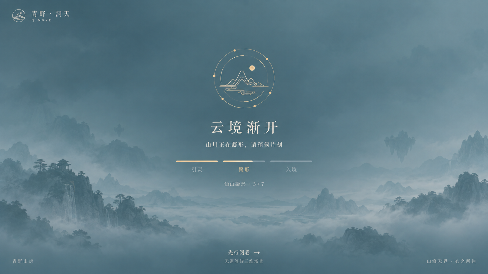

# 首次入境 · 全局 Loading

## 视觉方向



上图由内置图像生成工具生成，用于视觉参考，**不是线上网站截图**。实现采用青灰云雾、淡金山印、缓慢星轨和三段入境状态，与现有洞天的天色、字体和题材保持一致。

实际组件使用内联 SVG 与 CSS 绘制山印、远山和云雾，不加载此参考图，不新增字体或大图依赖。远山采用简化轮廓，因此实现不逐像素复刻参考图中的写实山景。组件在桌面、小屏和低高度视口下调整尺寸与间距，并保留安全区域。

## 状态与反馈

| 状态 | 界面反馈 | 完成条件 |
| --- | --- | --- |
| 引灵 | 云境渐开 · 正在唤醒云境 | 三维模块加载并开始准备模型 |
| 聚形 | 仙山凝形 · 已处理数量 / 7 | 七个模型请求及解码分别完成或失败 |
| 入境 | 云海铺展 · 正在绘制初景 | 渲染器完成第一帧并发出 `realm:ready` |
| 已就绪 | 解除交互锁定，遮罩淡出 | 默认约 480ms 淡出；没有额外的最短展示时间 |
| 慢网 | 云海尚在铺展，提供「静览入境」 | 可见页面累计等待 8 秒 |
| 静览 | 解除遮罩，使用已有背景和内容入口 | 主动选择静览、按 Escape、等待 25 秒或渲染失败 |

三段线条表示**阶段**，不表示下载百分比；动画不推进实际进度。模型计数来自请求和解码任务的真实完成回调。部分模型失败时显示「简景补全」，沿用已有程序化模型补位，不把失败资源说成成功下载。

## 退出与恢复

- 「先行阅卷」始终可用，直接进入 `/blog/`，无需等待三维场景。
- 主动进入静览会取消尚未完成的模型网络请求；已经开始的解码允许收尾，但不会再次创建或显示三维场景。
- 加载模块缺失或网络一直无响应时，独立内联脚本仍会在 25 秒后解除遮罩，不依赖应用 JS 成功执行。
- 静览页面提供原生「先行阅卷」和「重试入境」链接，即使洞天交互脚本没有成功加载，也能继续阅读或重新进入。
- 切到后台时暂停慢网计时，返回前台继续累计；不会因为后台停留而被自动判定超时。
- 使用浏览器后退 / 前进恢复页面时，不恢复阻塞遮罩。

## 全站范围

`BaseLayout` 统一接入组件。首页等待三维首帧；文章、搜索等内页在 `DOMContentLoaded` 时立即放行，不等待装饰性三维背景、所有图片或 `window.load`。首页书卷 iframe 不显示第二层全局 Loading，继续使用原有书卷局部加载提示。

关闭 JavaScript 时，遮罩保持隐藏，原有静态页面与 `noscript` 入口继续可用。每次完整文档进入均按当前资源状态处理，不以持久化「访问过」标记跳过真实等待；缓存命中时也不人为延长展示。

## 可访问性

- 遮罩有对话框名称，当前状态通过礼貌级别的实时区域更新。
- 加载期间背景使用 `inert`，主内容标记 `aria-busy`，键盘焦点保留在可用退出操作内。
- 完成后恢复原有 `inert` / `aria-busy` 状态，并将焦点移回页面。
- 系统 `prefers-reduced-motion` 与站内「入定」设置均禁用旋转、云雾漂移和淡出。
- 窄屏保留主状态、静览按钮与直接阅卷入口；低高度屏幕允许加载层自身滚动。

## 代码入口

| 文件 | 责任 |
| --- | --- |
| `src/components/GlobalLoading.astro` | 山印、阶段、状态和退出入口 |
| `src/styles/loading.css` | 内联的首屏样式、响应式布局与减少动态效果 |
| `src/loading/bootstrap.js` | 无外部依赖的状态处理、超时、焦点和恢复逻辑 |
| `src/components/ImmortalMist.astro` | 三维模块启动、进度转发、静览取消 |
| `src/world/assets.js` | 模型请求、解码、真实计数和取消后资源释放 |
| `src/world/world.js` | 首帧就绪、初始化失败、运行时渲染失败与清理 |

## 验证

```bash
node --test tests/loading.test.mjs
npm run build
git diff --check
```

自动化测试执行实际内联脚本，使用受控时钟和最小 DOM 替身覆盖首次进入、首帧门槛、进度乱序、部分失败、慢网、脚本缺失、静览竞态、后台计时、文章页、iframe、键盘、减少动态效果和 BFCache 恢复。

本次构建通过，12 项状态测试通过；构建仍提示现有 Three.js 分块体积超过 500 kB。自动化状态测试不等同于真实浏览器渲染测试。当前工作环境的浏览器安全策略禁止本地 HTTP 和文件预览，未完成实机视觉与 WebGL 加载验收，也未将参考图标为运行截图。

部署后建议用桌面与手机分别验证：关闭缓存首次打开首页、慢网下切换静览、禁止模型请求、直接打开文章、开启减少动态效果，以及返回上一页。确认首帧完成前遮罩不消失、静览后迟到的资源不覆盖静态页面、所有入口均可操作。

## 生图提示词

使用内置图像生成工具；提示词核心如下，实际代码以本页行为规则为准。

> 为青野山房 / 青野洞天生成一张 16:9 的全屏首次加载 UI 参考图，正面产品截图。青灰云雾、淡金山印、细线星轨、克制的远山轮廓；左上角品牌「青野 · 洞天」，中间「云境渐开」「山川正在凝形，请稍候片刻」，下方三阶段「引灵 / 聚形 / 入境」，当前聚形，真实任务计数示例「仙山凝形 · 3 / 7」。底部始终保留「先行阅卷 →」「无需等待三维场景」。不要百分比、估计秒数、设备样机、宣传海报或多方案拼图；视觉应可用轻量 SVG 与 CSS 实现。
